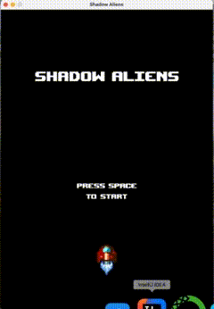
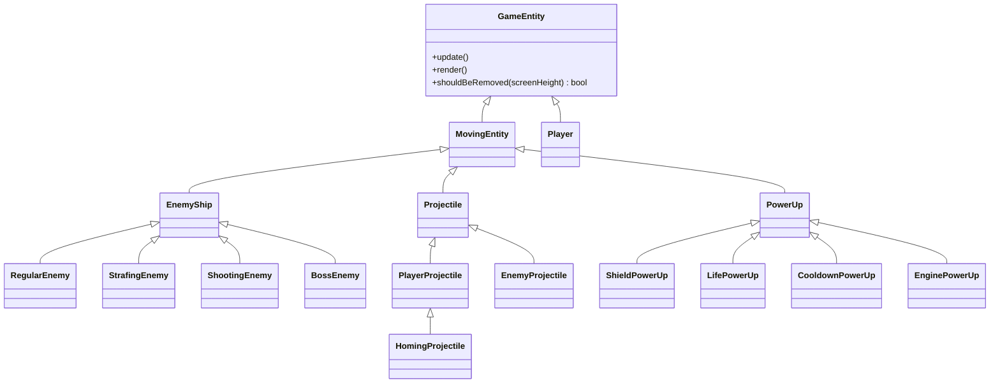

# Shadow Aliens

[](https://github.com/FRANCOIS128/shadow-aliens-java-game/actions/workflows/ci.yml)
[](https://adoptium.net/)
[](https://maven.apache.org/)
[](https://junit.org/junit5/)

A wave-based 2D space shooter written in Java on top of the
[BAGEL](https://github.com/eleanor-em/bagel) game library. The player pilots a
ship against successive waves of alien enemies, each with distinct movement and
attack behaviour, while collecting power-ups and chasing a high score.

The project started as a university OOP assignment and has been extended into a
maintainable, tested, and packaged application: clean object-oriented design,
a data-driven content pipeline, a JUnit 5 test suite, continuous integration,
and a single runnable fat jar.



---

## Highlights

- **Polymorphic entity model** — a single update/render/prune loop drives every
  enemy, projectile, power-up, and explosion, so new entity types slot in
  without touching the game loop.
- **Data-driven content** — every wave, enemy, power-up, position, timing, and
  score value lives in `gameData.properties`. Designers can re-balance or add
  content with zero code changes.
- **Enum-as-factory** — `EnemyType` and `PowerUpType` build their own concrete
  objects, removing `switch` statements from spawning logic.
- **Screen state machine** — `StartScreen → BattleScreen → PauseScreen →
  EndScreen` are decoupled behind a `GameScreen` interface and routed by a
  `ScreenManager`.
- **Deterministic dev-mode timescale** — speed up / slow down the entire
  simulation by running the fixed-timestep simulation a variable number of
  times per render frame.
- **Persistent high-score leaderboard** — final scores are saved to disk and
  the top results (plus a "new high score" banner) are shown on the end screen.
- **Four switchable weapons** — cannon, three-way spread, rapid laser, and a
  guided homing missile that smoothly steers toward the nearest enemy.
- **Multi-hit boss fight** — a boss wave with a health pool, strafing movement,
  and a downward bullet-fan attack.
- **Tested & automated** — 49 unit tests covering the core logic, run on every
  push via GitHub Actions, and a self-contained `java -jar` build.

---

## Tech stack

| Area        | Choice                                             |
|-------------|----------------------------------------------------|
| Language    | Java 21 (LTS)                                       |
| Game library| BAGEL (bundled), backed by LWJGL 3 / OpenGL / GLFW |
| Build       | Maven, `maven-shade-plugin` for the runnable jar    |
| Testing     | JUnit 5 (Jupiter)                                   |
| CI          | GitHub Actions                                      |

---

## Architecture

The codebase is organised into focused packages, each with a single
responsibility:

```
game
├── ShadowAliens          # thin entry point: load data, open window, delegate
├── core                  # game systems (waves, scoring, collisions, timescale)
├── screens               # GameScreen state machine + ScreenManager
├── entities              # GameEntity hierarchy (player, enemies, projectiles…)
│   ├── enemy             #   RegularEnemy / StrafingEnemy / ShootingEnemy
│   ├── projectile        #   PlayerProjectile / EnemyProjectile
│   └── powerup           #   Shield / Life / Cooldown / Engine power-ups
├── ui                    # HUD and text-screen renderers
└── data                  # property loading & spawn-info value objects
```

### Entity hierarchy



### Design patterns used

- **Template method** — `MovingEntity` defines the default fall-and-prune
  behaviour; subclasses override only what differs (e.g. `PlayerProjectile`
  moves up, `Explosion` is removed by timer).
- **Strategy / polymorphism** — `PowerUp.applyTo(Player)` / `expire(Player)`
  replace a type `switch` with per-type behaviour.
- **Factory (enum-as-factory)** — `EnemyType` / `PowerUpType` construct the
  right subclass for a given data entry.
- **State** — `GameScreen` implementations return the next `ScreenState`, and
  `ScreenManager` performs the transition.

---

## Getting started

### Prerequisites

- JDK 21+
- Maven 3.9+

The BAGEL library is bundled and pre-installed into a project-local Maven
repository (`local-maven-repo/`), so **no manual jar installation is required**.

### Run from source

```bash
mvn compile exec:java -Dexec.mainClass=game.ShadowAliens
```

or simply run `game.ShadowAliens` from your IDE with the working directory set
to the project root.

> On macOS, LWJGL needs the JVM flag `-XstartOnFirstThread`.

### Build a runnable jar

```bash
mvn clean package
java -jar target/shadow-aliens.jar   # run from the project root so res/ and gameData.properties resolve
```

### Run the tests

```bash
mvn test
```

### Use a custom data file

```bash
java -DgameData=/absolute/path/to/gameData.properties -jar target/shadow-aliens.jar
```

If the data file is missing or unreadable the program prints
`Error with {file path}` and exits with status `-1`.

---

## Controls

| Key        | Action                                             |
|------------|----------------------------------------------------|
| `SPACE`    | Start game / shoot / play again                    |
| `A` / `D`  | Move left / right                                  |
| `1`–`4`    | Switch weapon (cannon / spread / laser / homing)   |
| `ESC`      | Pause / unpause                                    |
| `G` / `F`  | Speed up / slow down the simulation (dev mode)     |
| `I`        | Toggle invincibility (dev mode)                    |
| `N`        | Skip to next wave (dev mode)                        |
| `R`        | Restart back to the Start Screen                   |

---

## Testing

The suite focuses on the pure game logic that does not require a graphics
context, so it runs headless in CI:

- `ScoreManager` — scoring rules and the zero-floor hit penalty
- `TimeScaleController` — speed multipliers and slow-motion frame skipping
- `WaveManager` / `Wave` — wave progression and completion
- `GameDataLoader` — property parsing and arrival-time sorting
- `HighScoreManager` — leaderboard sorting, capping, persistence, corrupt-file recovery
- `Weapon` — per-weapon fire-rate rules and number-key selection mapping
- `GameDataUtils`, `EnemyType`, `PowerUpType`, spawn-info value objects

```bash
mvn test   # 49 tests
```

---

## Roadmap

- [x] Persistent local high-score leaderboard
- [x] Multiple weapon types (spread / laser / homing projectiles)
- [x] Boss wave with a multi-hit health pool and a bullet-fan attack
- [ ] On-screen boss health bar
- [ ] Sound effects and background music
- [ ] Endless mode with procedurally generated waves

---

## Acknowledgements

- BAGEL game library (University of Melbourne, SWEN20003).
- Google Java Style Guide for naming and formatting conventions.

This project began as SWEN20003 Project 2 and was subsequently extended for a
personal portfolio.
